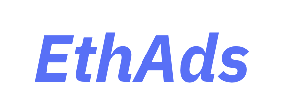

<div align="center">
  <h2> EthAds </h2>
  
  <p><br/></p>
  <strong>EthAds</strong>
  <p></p>
</div>

<br/>

<div align="center">
    <h3>Tech Stack</h3>
    
    
    
    
</div>

<br/>
<br/>
<br/>

## Key Functions

### Install

```
git clone https://github.com/MinchoMara/mincho-mara-contract.git
```

### Contract Build

```
yarn build
```

### Contract Test

```
yarn test

yarn coverage
```
